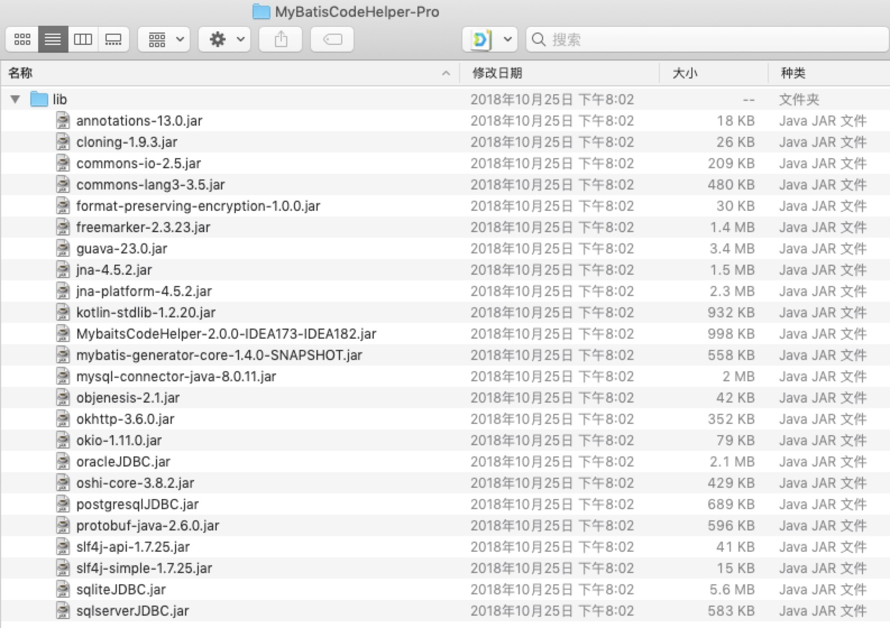
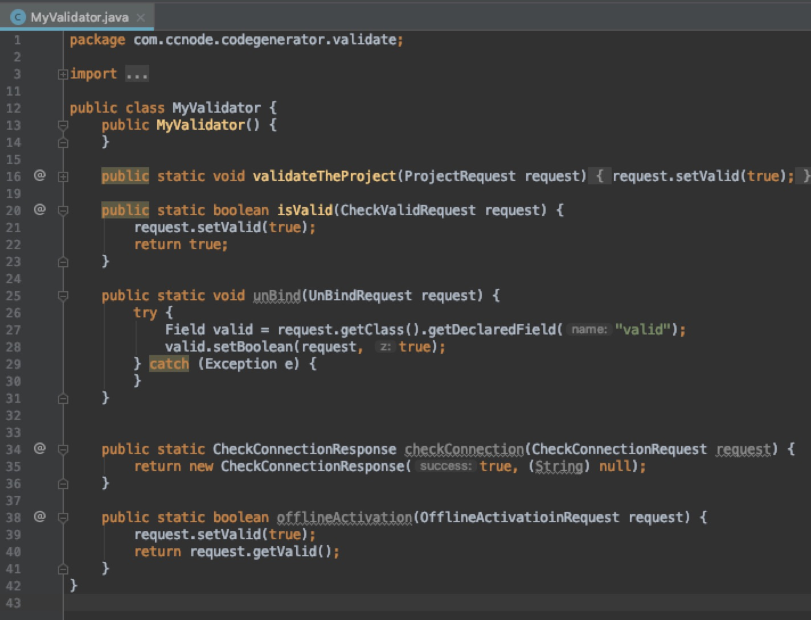

## 背景

写Java的同学够应该熟悉Mybatis，在开发过程中需要经常在Java代码和xml的mapper中间来回切换，
且代码和xml中不能很好的对应起来，基于此有了很多插件来提升效率。比如：MybatisCodeHelper。

此项目即对MybatisCodeHelper插件功能和代码进行研究，仅仅用于Java反编译学习使用。

## 操作过程

所有的代码都是可以进行反编译的，包括Java、C、C++等编程语言，只是这里面Java反编译更容易操作。

#### 工具

1. Intellij IDEA
2. Maven
3. JD-GUI

**工具的具体使用请自行Google。**

#### 步骤

1. 在Intellij IDEA上安装插件，使用时候会提示：**the plugin is not available**

2. 在Intellij IDEA官方网站下载MybatisCodeHelper的插件（是一个zip包），然后解压缩，如下图：

   

3. 通过上面提到的的JD—GUI工具，对两个名字很明显的jar包进行反编译

   1. MybaitsCodeHelper-2.0.0-IDEA173-IDEA182
   2. mybatis-generator-core-1.4.0-SNAPSHOT.jar

4. 通过搜索找到 步骤1 提到的错写信息找到 **PPValidator** 类里面的 validate 方法，通过阅读这个方法的逻辑知道具体调用是 MyValidate.validate 的方法

5. 继续在代码里面搜索 MyValidate，发现没有这个类，再次查看lib包里面的jar，寻找有可能包含MyValidate的jar包，通过看名字把有可能的都看了一遍，没有找到，开始懵逼了，难道是运行时动态生成代码？

6. 经过一番寻找，最后在guava-23.0.jar里面找到了，好鸡贼啊！

##### 重点来了

1. 通过IDEA把找到的MyValidate重写一遍，把里面的逻辑全部改掉。修改逻辑：把通过服务器验证路径去掉，直接返回验证通过的结果，改正后的代码：

   

2. 通过jar命令把编译后的MyValidator.class重新打包进jar文件里并且压缩生成插件的zip文件

3. 通过本地zip包安装插件，重启IDEA

4. 搞定
